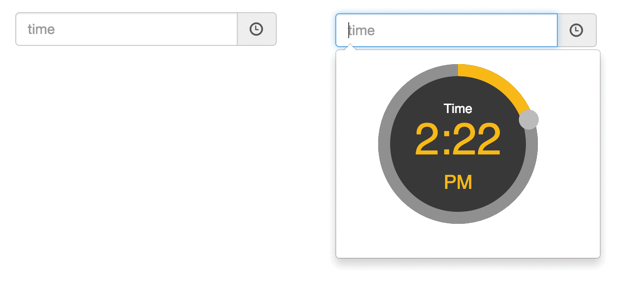

 

### Quick Start

Install with **bower**:

    bower install angular-ui-timepicker

Include script, css and dependencies (see [Installation](getstarted.html) page), add `ui-timepicker` as a dependency to
the angular app and add the `ui-timepicker` attribute to your form field:

    <input type="text" ui-timepicker />

### Issue tracking

All upcoming features and submitted issues can be tracked at [waffle.io](https://waffle.io/mirskytech/angular-ui-timepicker).

### Contributions

This is a large rewrite and packaging of [@zarknight](https://github.com/zarknight/ui-timepicker). Additional thanks go
to [@eonasdan](https://github.com/Eonasdan/bootstrap-datetimepicker) for his work on interactive popovers on inputs
without losing focus.

### License

[MIT License](https://raw.githubusercontent.com/mirskytech/angular-ui-timepicker/master/LICENSE)
